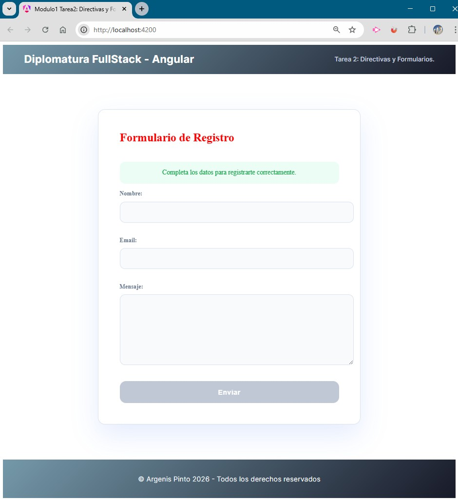
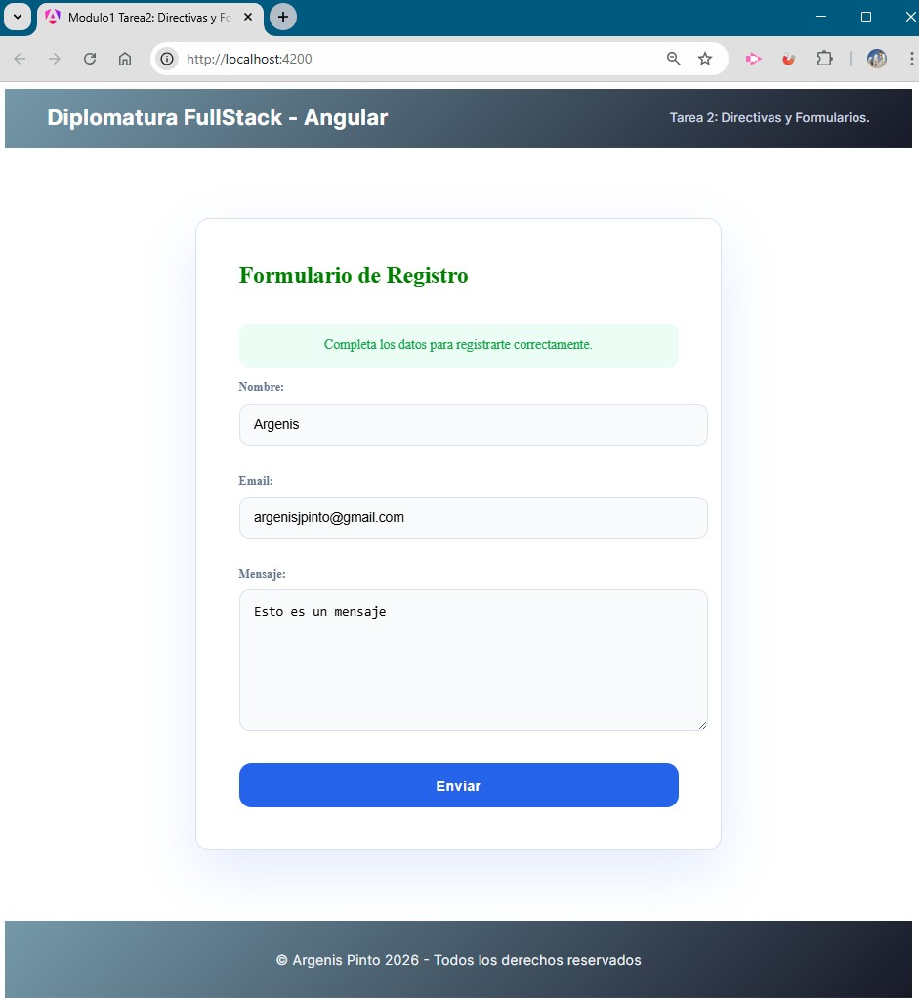
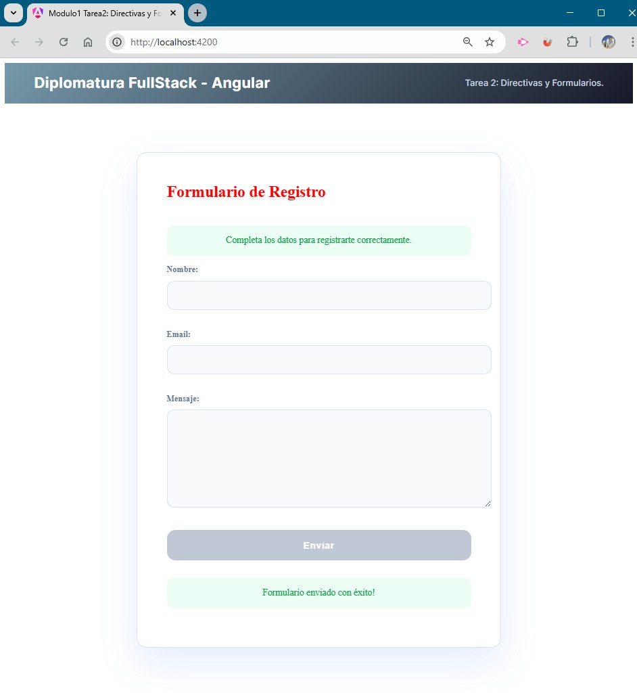

# Módulo 1 -- Unidad 2

## 📌 Tarea 2: Directivas y Formularios (Angular)

------------------------------------------------------------------------

## 📖 Descripción

Este proyecto fue desarrollado como parte del **Módulo 1 -- Unidad 2**
del curso *Desarrollo en Angular*.

El objetivo de la actividad fue implementar un **formulario reactivo**
utilizando Angular, aplicando validaciones y directivas estructurales y
de atributos en su versión más reciente (`@if` y `@for`).

------------------------------------------------------------------------

## 🎯 Objetivo de la consigna

-   Crear un componente `registro`.
-   Implementar un formulario reactivo con `FormBuilder`.
-   Configurar validaciones para los campos:
    -   **Nombre** (obligatorio, mínimo 3 caracteres).
    -   **Email** (obligatorio, formato válido).
    -   **Mensaje** (opcional).
-   Utilizar directivas:
    -   `@if` para mostrar mensaje de envío exitoso.
    -   `@for` para listar errores de validación.
    -   `[ngClass]` para resaltar campos inválidos.
    -   `[ngStyle]` para cambiar dinámicamente el color del título.
-   Deshabilitar el botón mientras el formulario sea inválido.
-   Mostrar los datos en consola y resetear el formulario tras un envío
    exitoso.

------------------------------------------------------------------------

## 🚀 Tecnologías utilizadas

-   Angular CLI
-   Angular Standalone Components
-   Formularios Reactivos (`ReactiveFormsModule`)
-   Directivas modernas (`@if`, `@for`)
-   TypeScript
-   HTML5
-   CSS3

------------------------------------------------------------------------

## 🗂️ Estructura del proyecto

    modulo-1-tarea-2/
    │
    ├── src/
    │   ├── app/
    │   │   ├── components/
    │   │   │   ├── header/
    │   │   │   │   ├── header.css
    │   │   │   │   ├── header.html
    │   │   │   │   ├── header.spec.ts
    │   │   │   │   └── header.ts
    │   │   │   │
    │   │   │   ├── footer/
    │   │   │   │   ├── footer.css
    │   │   │   │   ├── footer.html
    │   │   │   │   ├── footer.spec.ts
    │   │   │   │   └── footer.ts
    │   │   │   │
    │   │   │   └── registro/
    │   │   │       ├── registro.css
    │   │   │       ├── registro.html
    │   │   │       ├── registro.spec.ts
    │   │   │       └── registro.ts
    │   │   │
    │   │   ├── app.config.ts
    │   │   ├── app.config.server.ts
    │   │   ├── app.routes.ts
    │   │   ├── app.routes.server.ts
    │   │   ├── app.spec.ts  
    │   │   ├── app.ts
    │   │   ├── app.html
    │   │   └── app.css
    │   │
    │   ├── assets/
    │   │   ├── empty-form.jpg
    │   │   ├── completed-form.jpg
    │   │   └── form-sent.jpg
    │   │
    │   ├── index.html
    │   ├── main.ts
    │   ├── main.server.ts
    │   ├── server.ts
    │   └── styles.css
    │
    ├── angular.json
    ├── package.json
    └── README.md

------------------------------------------------------------------------

## 🧠 Conceptos aplicados

-   Formularios reactivos con `FormBuilder`
-   Validaciones con `Validators`
-   Directivas estructurales modernas (`@if`, `@for`)
-   Directivas de atributo (`[ngClass]`, `[ngStyle]`)
-   Deshabilitación dinámica del botón
-   Manejo de estados del formulario (`valid`, `invalid`, `touched`,
    `dirty`)
-   Reset del formulario tras envío exitoso

------------------------------------------------------------------------

## 🖼️ Capturas de pantalla

### 🟢 Formulario vacío

### 🟡 Formulario completo y válido

### 🔵 Formulario enviado

------------------------------------------------------------------------

## ⚙️ Instalación y ejecución

### 1️⃣ Clonar el repositorio

    git clone https://github.com/argenisjpinto/tareas-diplomatura-angular-999201565.git

### 2️⃣ Instalar dependencias

    npm install

### 3️⃣ Ejecutar el proyecto

    ng serve

Abrir en el navegador:

    http://localhost:4200

------------------------------------------------------------------------

## 🧪 Ejemplo de ejecución en consola

Al enviar el formulario correctamente, se muestran los datos ingresados:

    {
      nombre: "Juan Pérez",
      email: "juan@email.com",
      mensaje: "Hola, este es un mensaje de prueba"
    }

------------------------------------------------------------------------

## 👨‍🎓 Autor

Argenis Pinto\
Curso: Desarrollo en Angular\
Módulo 1 -- Unidad 2\
Centro de e-Learning UTN BA

------------------------------------------------------------------------

## 📚 Bibliografía

-   Angular Documentation -- Reactive Forms\
    https://angular.dev/guide/forms/reactive-forms

-   Angular Documentation -- Built-in Directives\
    https://angular.dev/guide/directives

-   Material del curso UTN -- Centro de e-Learning

------------------------------------------------------------------------

## ✅ Cumplimiento de la consigna

✔ Creación del componente `registro`\
✔ Implementación de formulario reactivo con validaciones\
✔ Uso correcto de `@if` y `@for`\
✔ Uso de `[ngClass]` y `[ngStyle]`\
✔ Deshabilitación del botón hasta que el formulario sea válido\
✔ Reset del formulario tras envío exitoso\
✔ Código organizado y documentado\
✔ Capturas incluidas\
✔ README completo con instrucciones