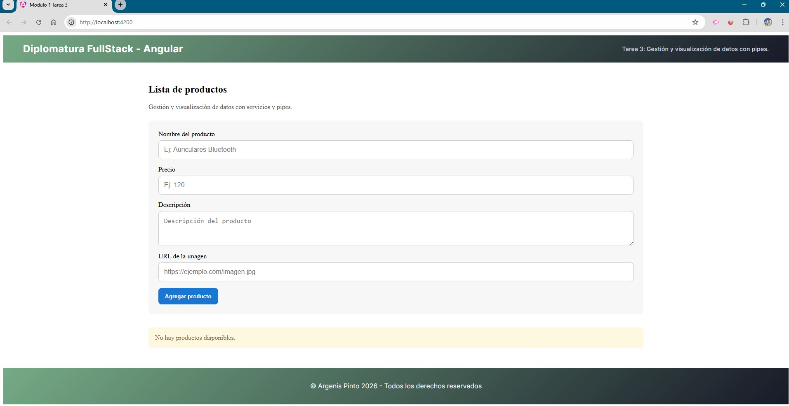
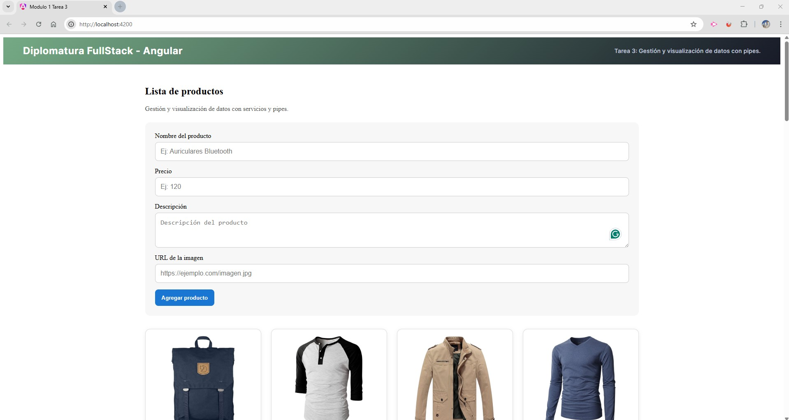
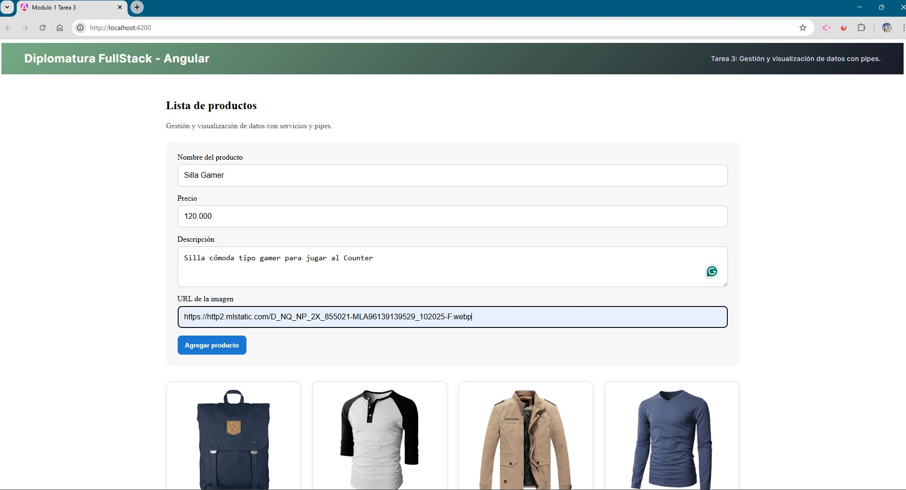
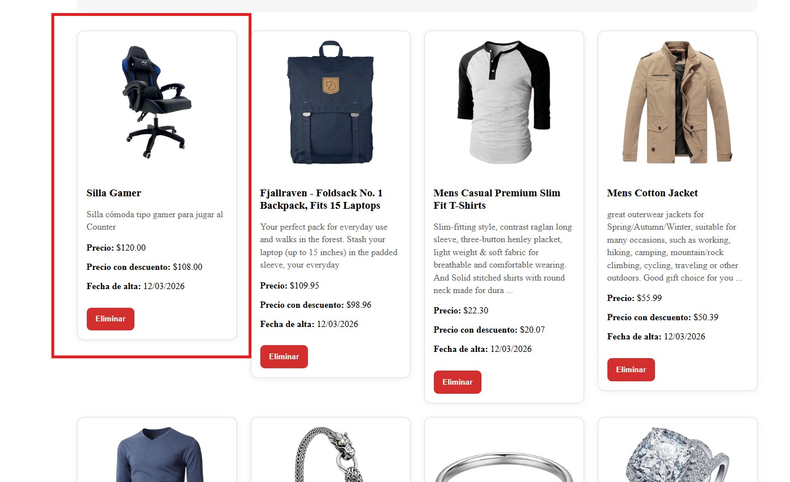

# Módulo 1 --- Unidad 3

## 📌 Tarea 3: Gestión y visualización de datos con Servicios y Pipes (Angular)

------------------------------------------------------------------------

# 📖 Descripción

Este proyecto fue desarrollado como parte del **Módulo 1 --- Unidad 3**
del curso **Desarrollo en Angular**.

El objetivo de la actividad fue implementar una **gestión de productos**
consumiendo una **API externa**, utilizando **Servicios en Angular** y
aplicando **Pipes estándar y personalizados** para mejorar la
visualización de los datos.

La aplicación permite:

-   Consultar productos desde una API.
-   Visualizar productos en una grilla.
-   Agregar nuevos productos mediante un formulario reactivo.
-   Eliminar productos.
-   Aplicar pipes para formatear información.

------------------------------------------------------------------------

# 🚀 Tecnologías utilizadas

-   Angular CLI
-   Angular Standalone Components
-   Angular HttpClient
-   Reactive Forms (`ReactiveFormsModule`)
-   Pipes estándar (`currency`, `date`)
-   Pipe personalizado (`descuento`)
-   Directivas modernas (`@if`)
-   TypeScript
-   HTML5
-   CSS3

------------------------------------------------------------------------

# 🗂️ Estructura del proyecto

    modulo-1-tarea-3/
    │
    ├── src/
    │   ├── app/
    │   │   ├── components/
    │   │   │   ├── header/
    │   │   │   │   ├── header.css
    │   │   │   │   ├── header.html
    │   │   │   │   ├── header.spec.ts
    │   │   │   │   └── header.ts
    │   │   │   │
    │   │   │   ├── footer/
    │   │   │   │   ├── footer.css
    │   │   │   │   ├── footer.html
    │   │   │   │   ├── footer.spec.ts
    │   │   │   │   └── footer.ts
    │   │   │   │
    │   │   │   └── lista-productos/
    │   │   │       ├── lista-productos.css
    │   │   │       ├── lista-productos.html
    │   │   │       ├── lista-productos.spec.ts
    │   │   │       └── lista-productos.ts
    │   │   │
    │   │   ├── pipes/
    │   │   │   └── descuento.pipe.ts
    │   │   │
    │   │   ├── services/
    │   │   │   └── products.service.ts
    │   │   │
    │   │   ├── app.config.ts
    │   │   ├── app.routes.ts
    │   │   ├── app.spec.ts
    │   │   ├── app.ts
    │   │   ├── app.html
    │   │   └── app.css
    │   │
    │   ├── assets/
    │   │   ├── empty-product-list.jpg
    │   │   ├── form-product-empty.jpg
    │   │   ├── form-product-full.jpg
    │   │   └── product-added.jpg
    │   │
    │   ├── index.html
    │   ├── main.ts
    │   └── styles.css
    │
    ├── angular.json
    ├── package.json
    └── README.md

------------------------------------------------------------------------

# 🧠 Conceptos aplicados

### Servicios

Creación de un servicio para centralizar las operaciones HTTP:

-   Obtener productos
-   Crear productos
-   Eliminar productos

Uso de:

-   HttpClient
-   Observable
-   catchError
-   throwError

------------------------------------------------------------------------

### Formularios Reactivos

Implementación de un formulario utilizando **FormBuilder** con
validaciones:

-   Nombre del producto (obligatorio)
-   Precio (obligatorio y mayor a 0)
-   Descripción (obligatoria)
-   URL de imagen (obligatoria)

------------------------------------------------------------------------

### Pipes estándar

Aplicación de pipes integrados de Angular:

    {{ producto.price | currency:'USD' }}

Formatea el precio como moneda.

    {{ producto.fechaAlta | date:'dd/mm/yyyy' }}

Formatea la fecha de alta del producto.

------------------------------------------------------------------------

### Pipe personalizado

Se creó un pipe personalizado para calcular un descuento:

    {{ producto.price | descuento:10 | currency:'USD' }}

Este pipe reduce el precio según el porcentaje indicado.

------------------------------------------------------------------------

# 🖼️ Capturas de pantalla

### 📦 Lista de productos vacía

### 📝 Formulario vacío

### 🟡 Formulario completo

### 🟢 Producto agregado

------------------------------------------------------------------------

# ⚙️ Instalación y ejecución

## 1️⃣ Clonar el repositorio

    git clone https://github.com/argenisjpinto/tareas-diplomatura-angular-999201565.git

## 2️⃣ Instalar dependencias

    npm install

## 3️⃣ Ejecutar el proyecto

    ng serve

Abrir en el navegador:

    http://localhost:4200

------------------------------------------------------------------------

# 🧪 API utilizada

La aplicación consume la API pública:

https://fakestoreapi.com/products

------------------------------------------------------------------------

# 👨‍🎓 Autor

Argenis Pinto\
Curso: Desarrollo en Angular\
Módulo 1 --- Unidad 3\
Centro de e-Learning UTN BA

------------------------------------------------------------------------

# 📚 Bibliografía

Angular Documentation --- HTTP Client\
https://angular.dev/guide/http

Angular Documentation --- Pipes\
https://angular.dev/guide/pipes

Angular Documentation --- Reactive Forms\
https://angular.dev/guide/forms/reactive-forms

Material del curso UTN --- Centro de e-Learning