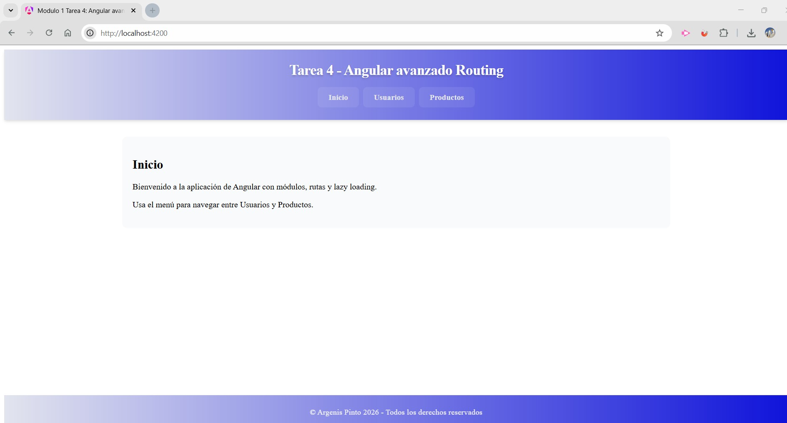
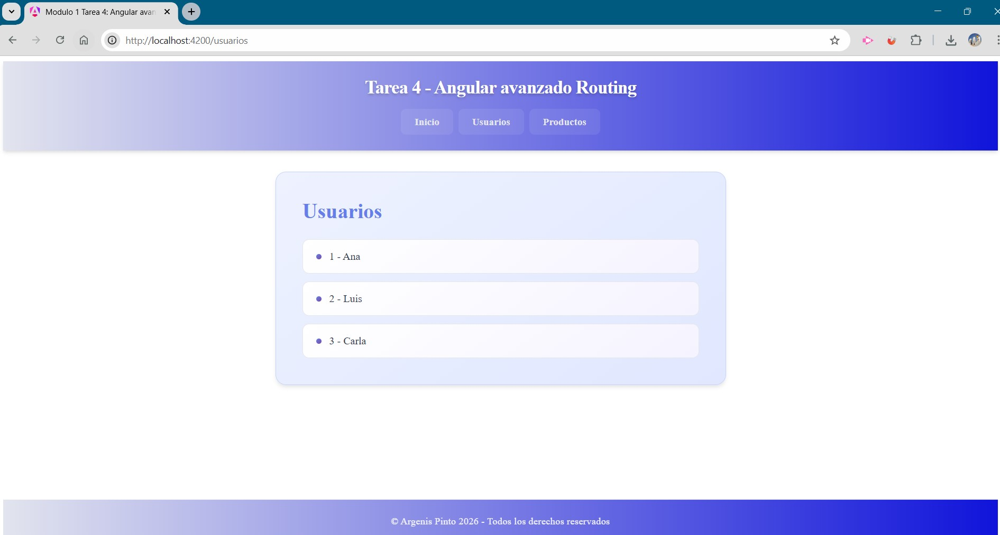
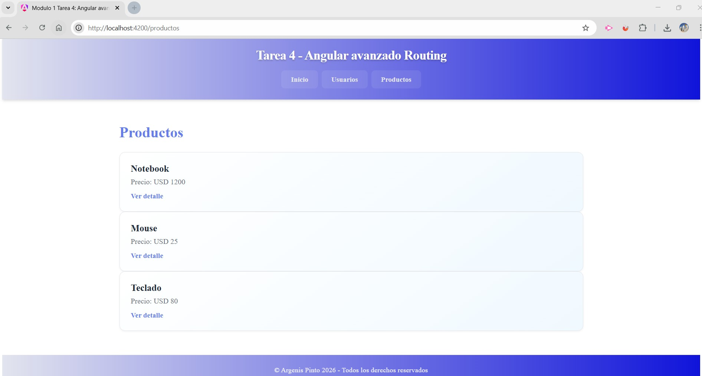

# Módulo 1 — Unidad 4

## 📌 Tarea 4: Angular avanzado — Routing

---

# 📖 Descripción

Este proyecto fue desarrollado como parte del **Módulo 1 — Unidad 4**
del curso **Desarrollo en Angular**.

El objetivo de la actividad fue implementar una aplicación utilizando:

- Routing en Angular
- Lazy Loading
- Módulos de funcionalidad
- Rutas dinámicas
- Persistencia de navegación con LocalStorage

La aplicación permite:

- Navegar entre distintas secciones (Inicio, Usuarios, Productos)
- Cargar módulos de forma diferida (lazy loading)
- Visualizar una lista de productos
- Acceder al detalle de un producto mediante rutas dinámicas
- Recordar la última ruta visitada

---

# 🚀 Tecnologías utilizadas

- Angular CLI
- Angular Modules (NgModules)
- Angular Router
- Lazy Loading
- TypeScript
- HTML5
- CSS3
- LocalStorage

---

# 🗂️ Estructura del proyecto

    modulo-1-tarea-4/
    │
    ├── src/
    │   ├── app/
    │   │   ├── components/
    │   │   │   ├── header/
    │   │   │   │   ├── header.component.css
    │   │   │   │   ├── header.component.html
    │   │   │   │   ├── header.component.spec.ts
    │   │   │   │   └── header.component.ts
    │   │   │   │
    │   │   │   ├── footer/
    │   │   │   │   ├── footer.component.css
    │   │   │   │   ├── footer.component.html
    │   │   │   │   ├── footer.component.spec.ts
    │   │   │   │   └── footer.component.ts
    │   │   │
    │   │   ├── core/
    │   │   │   └── services/
    │   │   │       └── storage.service.ts
    │   │   │
    │   │   ├── pages/
    │   │   │   └── home/
    │   │   │       ├── home.component.ts
    │   │   │       ├── home.component.html
    │   │   │       └── home.component.css
    │   │   │
    │   │   ├── usuarios/
    │   │   │   ├── usuarios.module.ts
    │   │   │   ├── usuarios-routing.module.ts
    │   │   │   └── pages/
    │   │   │       └── usuarios-lista/
    │   │   │
    │   │   ├── productos/
    │   │   │   ├── productos.module.ts
    │   │   │   ├── productos-routing.module.ts
    │   │   │   └── pages/
    │   │   │       ├── productos-lista/
    │   │   │       └── producto-detalle/
    │   │   │
    │   │   ├── app-module.ts
    │   │   ├── app-routing-module.ts
    │   │   ├── app.ts
    │   │   ├── app.html
    │   │   └── app.css
    │   │
    │   ├── assets/
    │   │   ├── home-view.jpg
    │   │   ├── products-view.jpg
    │   │   └── users-view.jpg
    │   │
    │   ├── index.html
    │   ├── main.ts
    │   └── styles.css
    │
    ├── angular.json
    ├── package.json
    └── README.md

---

# 🧠 Conceptos aplicados

### Routing

Configuración de rutas principales mediante:

    RouterModule.forRoot()

Y rutas internas en módulos con:

    RouterModule.forChild()

---

### Lazy Loading

Carga diferida de módulos:

- Usuarios
- Productos

Esto mejora el rendimiento inicial de la aplicación.

---

### Rutas dinámicas

Se implementó una ruta dinámica:

    /productos/:id

Permite visualizar el detalle de cada producto.

---

### Navegación

Uso de:

- routerLink
- router-outlet

Para la navegación entre vistas.

---

### Persistencia con LocalStorage

Se guarda la última ruta visitada:

- Mejora la experiencia del usuario
- Permite redirigir automáticamente al recargar

---

# 🖼️ Capturas de pantalla

### 🏠 Vista de inicio

### 👥 Vista de usuarios

### 🛍️ Vista de productos

---

# ⚙️ Instalación y ejecución

## 1️⃣ Clonar el repositorio

    git clone https://github.com/argenisjpinto/tareas-diplomatura-angular-999201565.git

## 2️⃣ Instalar dependencias

    npm install

## 3️⃣ Ejecutar el proyecto

    ng serve

Abrir en el navegador:

    http://localhost:4200

---

# 👨‍🎓 Autor

Argenis Pinto  
Curso: Desarrollo en Angular  
Módulo 1 — Unidad 4  
Centro de e-Learning UTN BA

---

# 📚 Bibliografía

Angular Documentation — Routing  
https://angular.dev/guide/routing

Angular Documentation — Lazy Loading  
https://angular.dev/guide/lazy-loading

Material del curso UTN — Centro de e-Learning